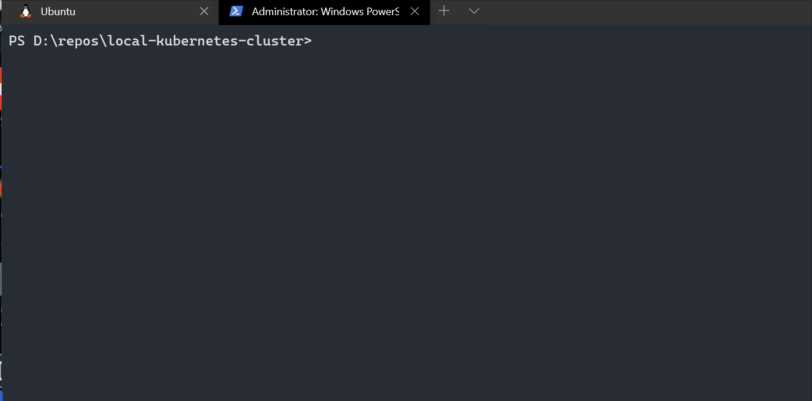

### Create a Local Kubernetes Cluster
If you want to have a Kubernetes cluster to practice for your CKA/CKAD | If you want to build a Kubernetes cluster on your own | If you don't want to use minikube or Docker for Windows | Then his Vagrantfile will build a cluster on your local machine

### Prerequisites
- MEM: 12 or 16 GB
- CPU: 4 ore more physical cores
- Install Vagrant > 2.2.9
- Install VirtualBox > 6.1
- Install kubectl > 1.18
- Install git

### Troubleshooting
```
# If you get Hash Sum mismatch during apt install:
# Disable Hyper-V on your machine
# On Windows search for "Turn Windows Features"
# Untick Hyper-V option
# [ ] Hyper-V
```

### Build Cluster

```
# Navigate to local-kubernetes-cluster folder
# Build and configure VMs
vagrant up
```

### Use Cluster
```
# Copy .kube/config file from master
scp root@172.42.42.100:/home/vagrant/.kube/config config
Password: kubeadmin
cp config ~/.kube/config

# Try kubectl commands Unix:
kubectl get nodes

# NAME      STATUS   ROLES    AGE   VERSION
# master    Ready    master   23m   v1.18.8
# worker1   Ready    <none>   22m   v1.18.8
# worker2   Ready    <none>   20m   v1.18.8

kubectl run nginx --image=nginx --dry-run=client -o yaml
kubectl run nginx --image=nginx --dry-run=client -o yaml > nginx.yaml
kubectl apply -f nginx.yaml
kubectl get pods

# NAME    READY   STATUS    RESTARTS   AGE
# nginx   1/1     Running   0          13m
```

### Cluster Resource usages:
```
Before VMs build:
CPU: 9% (4 Core, 3.2 GHz)
MEM: 5.2GB (16GB)

After VMs build:
CPU: 15% (4 Core)
MEM: 9.4GB (16GB)
```

### Installing kubectl

```
### Windows ###
# Open Powershell as Administrator
# Install Chocolatey: https://chocolatey.org/
# Once installed run:
choco install kubernetes-cli -y
# Try kubectl
kubectl version
kubectl get nodes
```

```
### Unix ###
## Add this to your ~/.bashrc or ~/.bash_aliases file:
export PATH=~/bin:$PATH
# or
# echo "export PATH=~/bin:\$PATH" >> ~/.bashrc

## Install kubectl
export KUBECTL_VERSION=1.18.8
mkdir -p $HOME/bin/ && cd $HOME/bin/ && curl -L --remote-name-all https://storage.googleapis.com/kubernetes-release/release/v${KUBECTL_VERSION}/bin/linux/amd64/kubectl && chmod 755 kubectl && cd -

## Check version
kubectl version
```

### Ability to ssh into VMs
```
# In \local-kubernetes-cluster directory run:
PS D:\repos\local-kubernetes-cluster> vagrant ssh master
vagrant@master:~$ sudo -s
root@master:~# systemctl status docker | grep "Active:"
   Active: active (running) since Sun 2020-08-23 18:58:59 UTC; 1h 0min ago

# Same for worker1 and worker2
PS D:\repos\local-kubernetes-cluster> vagrant ssh worker1
PS D:\repos\local-kubernetes-cluster> vagrant ssh worker2
```

### Suspend and Resume VMs
```
# Suspend Vms
# In \local-kubernetes-cluster directory run:
PS D:\repos\local-kubernetes-cluster> vagrant suspend

# Resume Vms
PS D:\repos\local-kubernetes-cluster> vagrant resume
```

### Delete Cluster and VMs
```
# If you want to destroy the Virtual Machines built for this cluster use:
vagrant destroy -f
```

### WSL1 Support for kubectl
```
# If you have WSL1 already activated and created run these in powershell
# My WSL path for example: c:\Users\jturi\AppData\Local\Packages\CanonicalGroupLimited.UbuntuonWindows_79rhkp1fndgsc\LocalState\rootfs
# Copy config to WSL \home\jturi\.kube\config
PS D:\repos\local-kubernetes-cluster> cp config c:\Users\jturi\AppData\Local\Packages\CanonicalGroupLimited.UbuntuonWindows_79rhkp1fndgsc\LocalState\rootfs\home\jturi\.kube\config
# In WSL1:
kubectl get nodes

# NAME      STATUS   ROLES    AGE   VERSION
# master    Ready    master   23m   v1.18.8
# worker1   Ready    <none>   22m   v1.18.8
# worker2   Ready    <none>   20m   v1.18.8
```

### WSL1 Support for Vagrant
```
alias vagrant='vagrant.exe '

$ vagrant status
Current machine states:

master                    running (virtualbox)
worker1                   running (virtualbox)
worker2                   running (virtualbox)

$ vagrant ssh master
Welcome to Ubuntu 16.04.7 LTS (GNU/Linux 4.4.0-187-generic x86_64)

 * Documentation:  https://help.ubuntu.com
 * Management:     https://landscape.canonical.com
 * Support:        https://ubuntu.com/advantage


0 packages can be updated.
0 updates are security updates.

New release '18.04.5 LTS' available.
Run 'do-release-upgrade' to upgrade to it.


Last login: Sun Aug 23 21:40:44 2020 from 10.0.2.2
vagrant@master:~$
```
